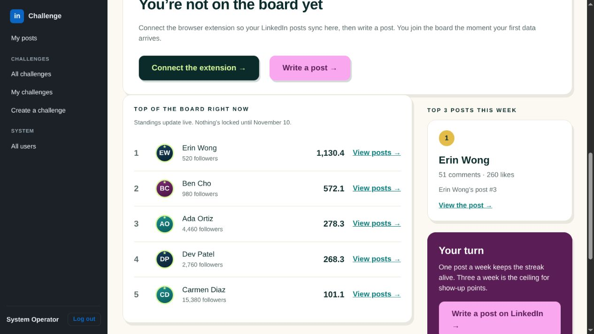
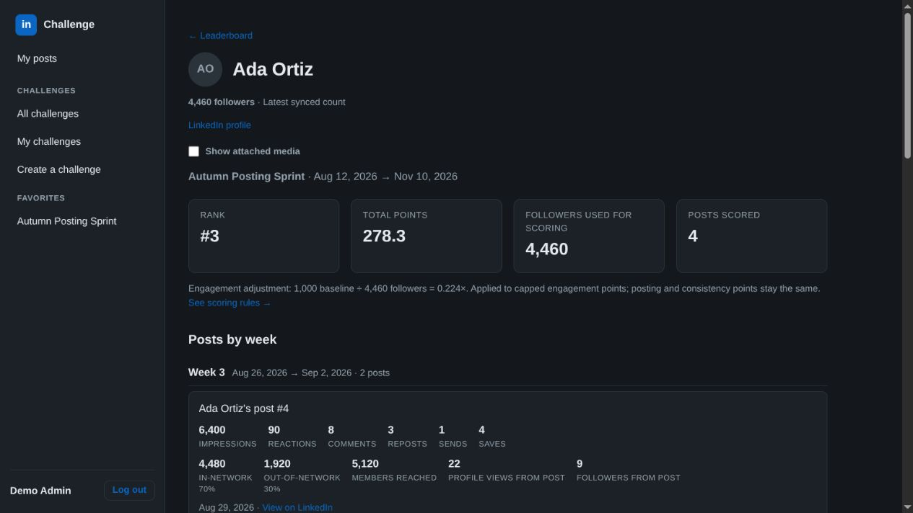
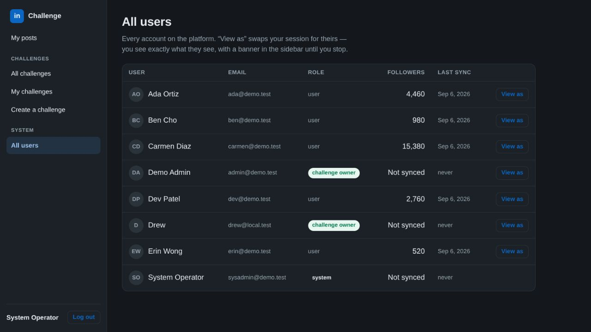

# Follower count visibility

Prototype screenshots use isolated, seeded demo accounts and data.

- The challenge board shows the follower count used for scoring below every participant name. Names open that participant's results in the same challenge.
- Participant results show the latest known count, the scoring count, and the engagement multiplier. These counts may differ for historical challenges.
- My posts shows the latest known follower count even without challenge results.
- All users and the admin challenge overview include a Followers column.
- Missing readings display as not synced; a known zero remains zero. A partial profile sync does not erase a previous known count.

## Screenshots

## Verification

- Generated and built the typed API client, compiled the server, and passed TypeScript checking.
- All 7 Rust unit tests and the existing authentication end-to-end script passed.
- Local API checks exercised participant-to-teammate access, rejection of non-admin access to All users, latest-known fallback after a partial sync, true zero counts, and never-synced accounts.
- Browser verification covered the board, clicking a participant name, challenge-aware back navigation, and All users.

No schema migration or scoring formula change is required. Production deployment is separate from this PR.
