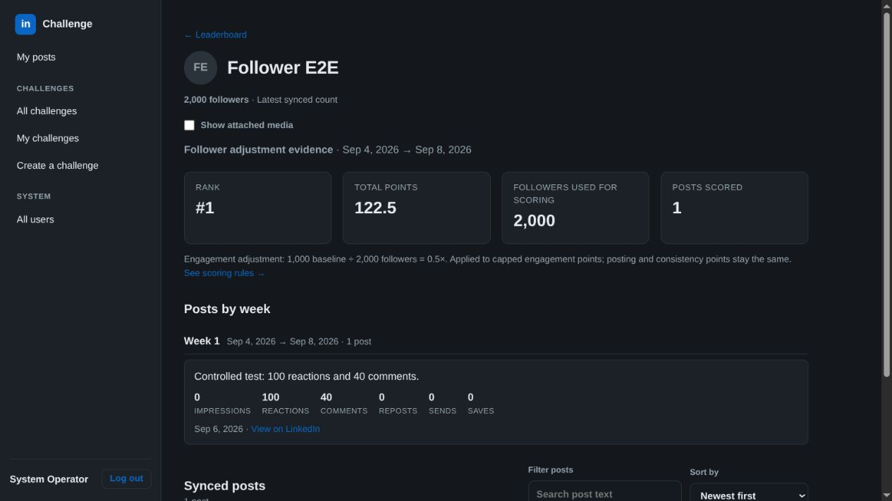
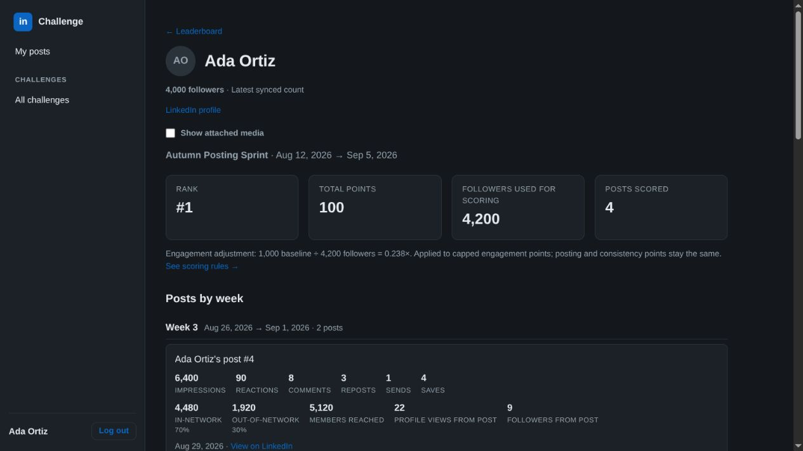
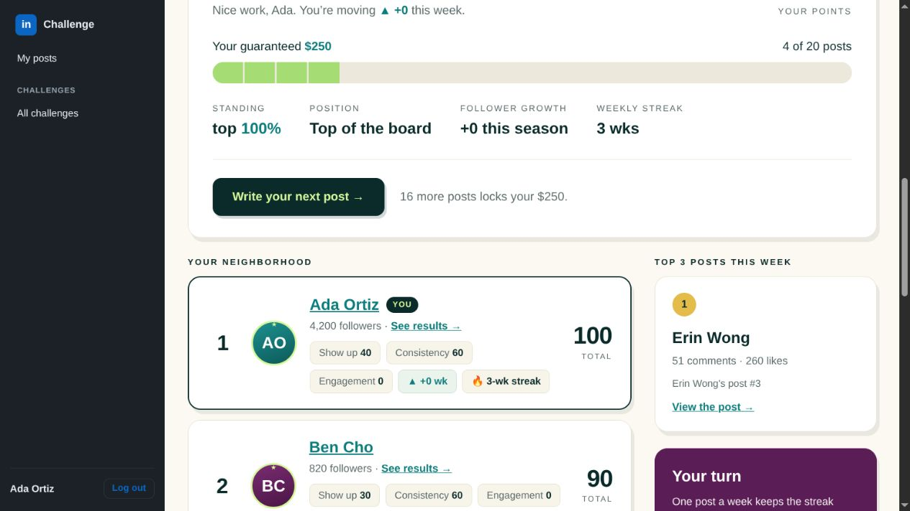
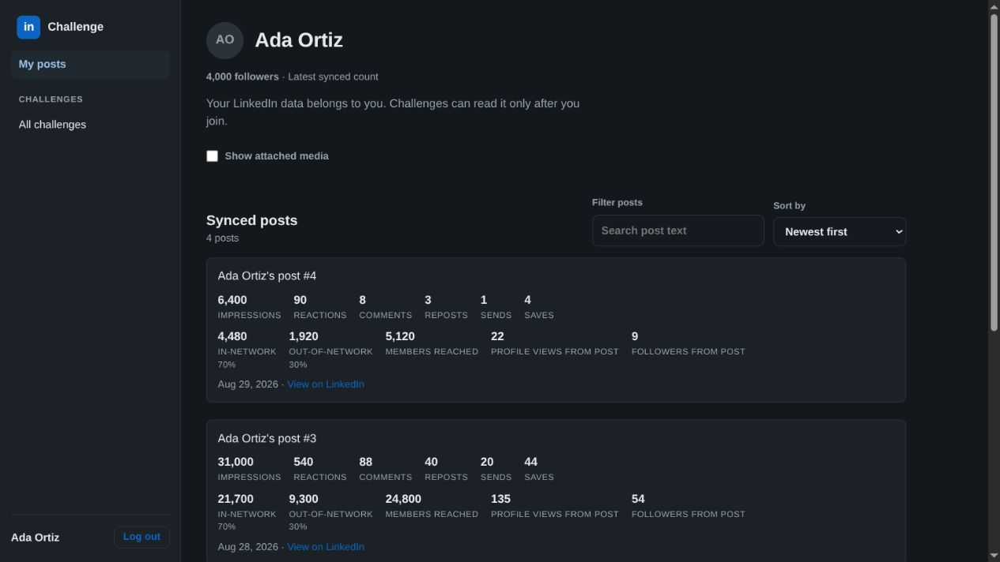
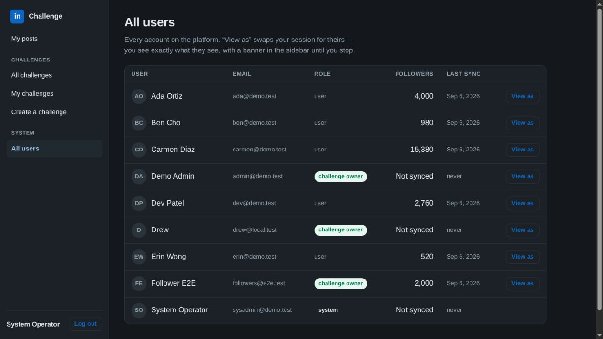
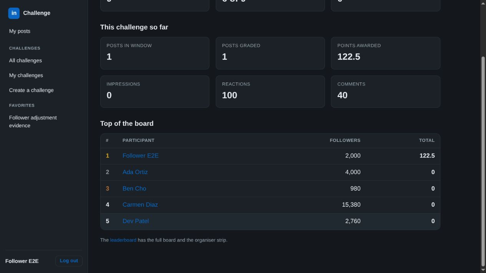

# End-to-end verification

Verified locally against the compiled server using disposable databases and seeded test accounts. No production data was used.

## Results

- **19 automated end-to-end assertions passed.** Run `just test-followers-e2e`. This builds the server and exercises real HTTP authentication, sync ingestion, persisted snapshots, scoring, and API responses. It creates and cleans up its own database and server. Use `python3 server/scripts/test-followers-e2e.py --keep` after building to retain the fixtures for browser inspection.
- **12 browser checks passed**, covering login, board-to-member navigation as a regular participant, teammate visibility, challenge-aware back navigation, personal counts, All users, admin overview links, and displayed adjustment values. Assertions ran through the Codex browser tool; the recorded results are in [browser-checks.json](browser-checks.json). These browser checks are separate from the repeatable Python suite.
- No console errors were reported in those browser flows.
- The existing authentication end-to-end suite, all 7 Rust tests, server build, and TypeScript check passed.

The automated suite caught a real bug: two syncs in one second could leave All users displaying the first count while member results displayed the later count. Snapshot selection now orders by timestamp and then snapshot ID on both paths. The regression suite explicitly confirms that its rapid syncs exercise a same-second timestamp tie.

## Independent scoring example

The controlled post has 100 reactions and 40 comments. Default rules yield:

1. Raw engagement: `100 × 0.2 + 40 × 5 = 220`.
2. Apply the cap: `150 + (220 − 150) × 0.5 = 185`.
3. Scale for 2,000 followers: `185 × (1,000 / 2,000) = 92.5`.
4. Add 10 posting points and 20 consistency points: **122.5 total**.

The suite checks each relevant result against these constants. It also checks disabled normalization (185 engagement, 215 total), missing and zero followers, partial syncs, access restrictions, and historical scoring counts.

## Latest audience versus historical scoring

Ada's latest count is 4,000. The historical challenge uses its in-window reading of 4,200, producing the displayed `1,000 / 4,200 = 0.238×` adjustment. This fixture intentionally ends before the seeded post-metric snapshots, so its engagement points are zero; the active controlled fixture above verifies nonzero engagement scoring.

## Scope

These checks cover the server's sync-to-display path and desktop browser flows. They do not validate LinkedIn's live collector, production hosting, or every responsive viewport. Production remains undeployed.
